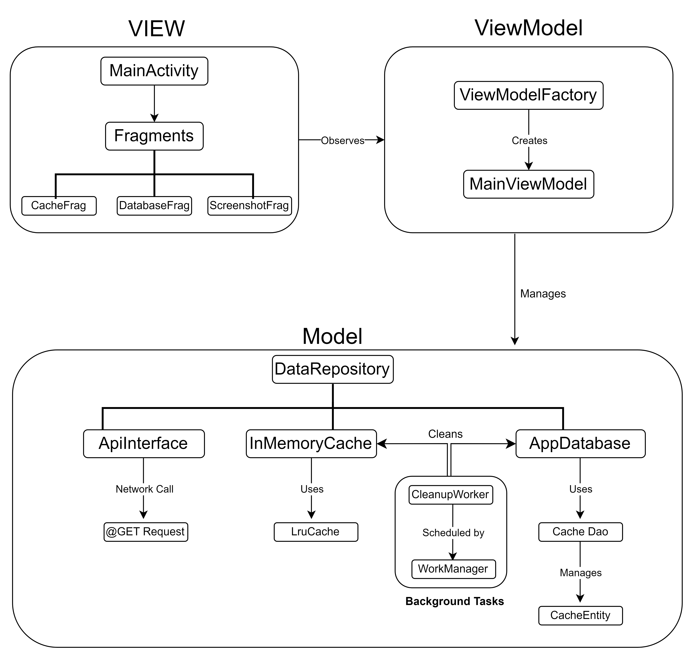

# Quick Query Android Application

## Overview

Quick Query is a sophisticated Android application designed to showcase the power of modern mobile application architecture using MVVM (Model-View-ViewModel). This app provides a robust framework for querying and displaying country-specific details efficiently, leveraging various modern Android development tools and libraries.

## Features

- **Dynamic Country Search**: Search and display detailed information about countries.
- **Caching Mechanism**: Utilizes LRU (Least Recently Used) cache and Room database to enhance performance and reduce network usage.
- **Background Cleanup**: Automated cleanup tasks to maintain cache and database integrity using WorkManager.
- **Responsive and Adaptive UI**: Crafted using Material Design guidelines, provides a seamless user experience across different Android devices.
- **Advanced Image Handling**: Incorporates image capturing, saving, and viewing functionalities within the app context.

## Architecture

Quick Query is structured around the **MVVM (Model-View-ViewModel)** architecture, promoting a clean separation of concerns, easier testing, and more manageable code. The architecture components used include:

- **Model**: Manages business logic and data handling, backed by Retrofit for network calls, Room for persistence, and an LRU cache for temporary data storage.
- **ViewModel**: Mediates between the Model and the View, utilizing LiveData to handle data streams reactively.
- **View**: UI components that observe ViewModel entities, fostering a reactive UI that updates efficiently in response to data changes.



*Directions: Data flows from the network and database to the Repository, then to the ViewModel, and finally to the UI. Background tasks are managed via WorkManager, integrating cleanly with the overall architecture.*

## Tech Stack

- **Kotlin**: Primary language for application development.
- **Android SDK**: User interface design and interaction.
- **Retrofit**: Handling network requests.
- **Gson**: Serialization and deserialization of JSON.
- **Room Database**: Local data persistence.
- **LiveData & ViewModel**: Lifecycle-aware data handling.
- **LruCache**: Fast memory storage for frequently accessed data.
- **WorkManager**: Managing background tasks efficiently.
- **Material Components**: Modern material design for UI components.

## Setup Instructions

### Prerequisites

- Android Studio 4.1 or higher.
- JDK 8 or higher.
- An Android device or emulator with API level 21 (Lollipop) or higher.

### Building the Project

1. **Clone the repository:**
   ```bash
   git clone https://github.com/Krishna-Vamsi-G/Quick-Query.git
   ```
2. **Open the project in Android Studio:**
   - Launch Android Studio.
   - Click on "Open an existing Android Studio project".
   - Navigate to the cloned directory.
   - Select the project and open it.

3. **Sync the project with Gradle:**
   - Android Studio should automatically sync the project with Gradle files. If it doesn't, click on "Sync Project with Gradle Files" from the File menu.

4. **Run the project:**
   - Connect an Android device to your computer or set up an emulator.
   - Run the app by clicking on the 'Run' icon in the toolbar.

## Contribution Guidelines

To contribute to the Quick Query project, please follow these guidelines:

1. **Fork the repository** - Create your copy of the project.
2. **Create a branch** - Make a branch for your changes and enhancements.
3. **Commit your changes** - Describe what and why you changed, not how.
4. **Open a Pull Request (PR)** - Submit your contributions back to the project.
5. **Code Review** - Maintain the code quality and integrate feedback from the code reviews.

Contributions to improve the functionality, add features, or fix bugs are always welcome.
